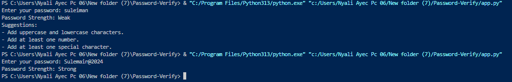

---

# Password Strength Checker

## **Overview**

The **Password Strength Checker** is a Python script that evaluates the strength of a given password based on various criteria and provides suggestions for improvement. It checks the following aspects of a password:

- **Length**
- **Uppercase and lowercase characters**
- **Numbers**
- **Special characters**
- **Commonly used passwords**

The password strength is categorized as **"Weak"**, **"Medium"**, or **"Strong"**, and the user is provided with suggestions to improve the password based on the evaluation.

---

## **Features**

- Evaluates password length and strength.
- Suggests improvements based on:
  - Password length.
  - Inclusion of uppercase and lowercase characters.
  - Presence of numbers and special characters.
  - Common password check.

---

## **How to Use**

1. **Clone or download the repository**:
   ```bash
   git clone https://github.com/hetrox8/Password-Verify.git
   cd Password-Verify
   ```

2. **Install dependencies** (if any):
   ```bash
   pip install -r requirements.txt
   ```

3. **Run the script**:
   ```bash
   python app.py
   ```

4. **Enter your password** when prompted. The script will evaluate the password and provide feedback on its strength and suggestions for improvement.

---

## **Example Usage**



```plaintext
Enter your password: Suleiman
Password Strength: Weak
Suggestions:
- Add at least one number.
- Add at least one special character.
```

---

## **Video Demonstration**

For a step-by-step guide, watch the video demonstration:

[](assets/video.mp4)

---

## **Future Improvements**

We plan to enhance this project with the following features:

- **Real-time feedback**: Use a GUI (e.g., with Tkinter) or a web app (with Flask or Django) for a more interactive user experience.
- **Password Leak Database Integration**: Integrate with a password leak database (e.g., Have I Been Pwned) to check if the entered password has been exposed in any data breaches.
- **Password Encryption**: Implement encryption to securely store and check passwords using hashing techniques such as bcrypt.

---

## **Contribution**

Feel free to fork this project, contribute, and suggest any improvements. Follow these steps:

1. Fork the repository.
2. Create a new branch (`git checkout -b feature/YourFeatureName`).
3. Commit your changes (`git commit -m 'Add some feature'`).
4. Push to the branch (`git push origin feature/YourFeatureName`).
5. Open a pull request.

---

## **License**

This project is licensed under the MIT License. See the [LICENSE](LICENSE) file for details.

---

## **Contact**

For questions or support, contact:
- **Name**: Nyali Ayec Pc 06
- **Email**: [your-email@example.com](mailto:dretrevor8@gmail.com)

---

Enjoy using the Password Strength Checker! 🚀

---

### **Notes**
- Replace `<repository-url>` with the actual URL of your repository.
- Ensure the `assets/video.mp4` file exists and is correctly linked in the `Video Demonstration` section.
- If you don’t have a `LICENSE` file, you can create one or remove the **License** section.

Let me know if you need further adjustments!
